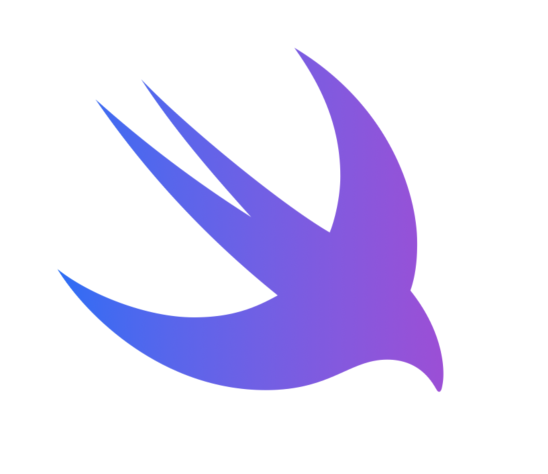

### SwiftUI - Mask content with simple view to create a nice effect
Masks are a very easy way to create fun effects in SwiftUI.

#### Here is an example of a very basic view that masks a linear gradient with the given content.
An overlay is used on the initial content to make sure that the gradient fits the frame of the content perfectly.

``` swift
struct ContentMaskView<Content: View>: View {
    let content: () -> Content
    
    var body: some View {
        content()
            .foregroundColor(.clear)
            .overlay {
                LinearGradient(
                    colors: [.blue, .purple],
                    startPoint: .leading,
                    endPoint: .trailing
                )
                .mask(content)
            }
    }
}

```

#### Which can be used like this:
``` swift
ContentMaskView {
  Image(systemName: "swift")
    .imageScale(.large)
    .font(.system(size: 140))
}
```

#### Result:

