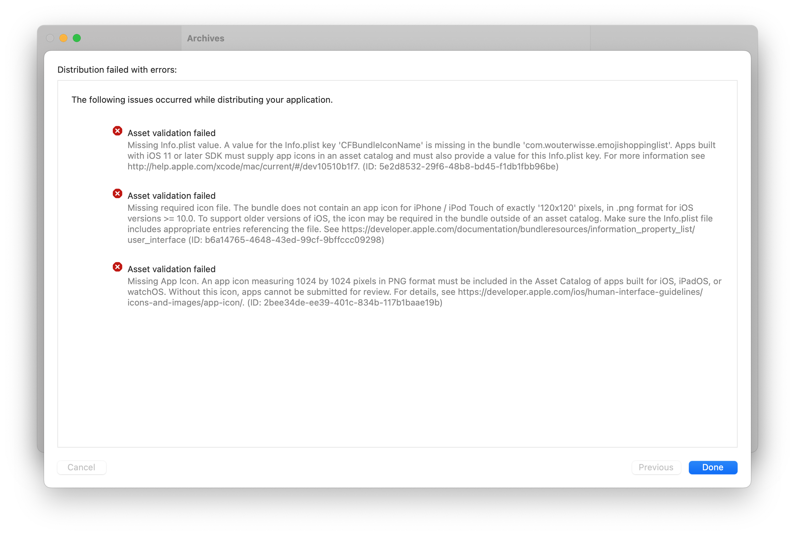

### Xcode - Single size app icon
Xcode 14 introduced a way to create your app icon with just one `1024x1024` image. Just select `Single Size` in the attributes panel of your `AppIcon` file.  

Note: For me it only worked when my Asset Catalog containing my iconset was placed in the root of my project. I had it in `Resources/…` before, but that resulted in validation errors when uploading the app to the AppStore. Also make sure the image does not contain an alpha layer.

   
    
   <em>Weird errors because my Asset Catalog containing the AppIcon was not in the root of my Xcode project.</em>

